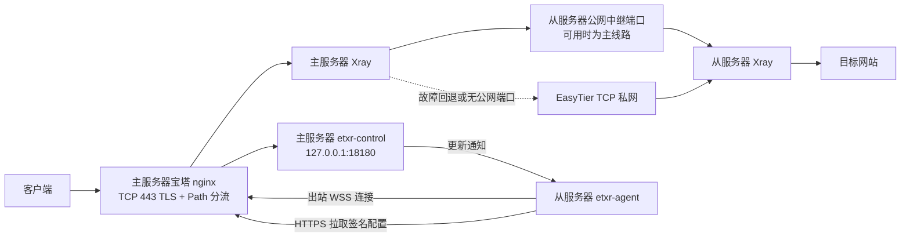

# ETXR v0.13.3

ETXR 是面向 Debian 12 空白系统的一站式中文菜单脚本，用一份脚本安装主服务器或任意数量的从服务器。它管理 Xray、sing-box、EasyTier、订阅和用户配置，并可复用宝塔 nginx 的 TCP 443。

## 主要能力

- 主服务器：VLESS + XHTTP + nginx TLS，可选 Reality + XHTTP、Hysteria2；HY2 可用 UDP 443 与网站的 TCP 443 共存。
- 从服务器：粘贴 Pair ID 后在本机选择 XHTTP + TLS、Reality + XHTTP、Hysteria2；TCP/UDP 443 均可共用。
- 主从中继：VLESS Encryption + Vision + RAW。
- 公网中继可用时优先直连，探测失败后回退 EasyTier。
- 没有公网端口的从服务器只使用 EasyTier。
- 从服务器开机时先等待 EasyTier 私网地址建立，再启动绑定私网地址的 Xray 中继。
- 用户新增、暂停、恢复和删除后，通过 WSS 通知从服务器，再由从服务器通过 HTTPS 拉取签名配置。
- 自动生成订阅，多用户共用协议监听端口，不创建单用户端口。
- 按用户统计上传、下载和总流量，主服务器自动汇总所有从服务器。
- 按用户分别设置上传和下载 Mbps，`0` 表示不限速；设置会自动下发。
- Xray 与 sing-box 均配置 BT 拒绝规则。
- 中文数字菜单可查看状态、日志、资源占用、EasyTier 节点和配置下发结果，也可在线更新 Xray。

## 网络结构



控制通道不增加公网管理端口。主服务器的 `18180` 只监听 `127.0.0.1`，外部连接通过随机 nginx Path 复用现有 HTTPS 443。

## 使用范围

- 系统：Debian 12，使用 root 运行。
- 推荐从重装后的空白系统开始。
- 脚本只读取 `/etc/etxr` 和 `/var/lib/etxr`，不导入历史项目目录或旧状态。
- 检测到宝塔时复用 `/www/server/nginx/sbin/nginx`，不会安装第二套 nginx。
- 宝塔模式可选用 `stream_ssl_preread` 按 SNI 共享 TCP 443：Reality 进入本机 Xray，其他域名进入宝塔 HTTPS。
- Hysteria2 可选择 UDP 443。确认后会自动备份并关闭 nginx QUIC/HTTP3，但保留 HTTPS、HTTP/2 和 TCP 443。
- 从服务器的 Reality 密钥只在从服务器本机生成，不由主服务器生成或下发。
- 无宝塔时按需安装 Debian nginx 和 `libnginx-mod-stream`；有宝塔时只复用宝塔 nginx。

## 启动菜单

推荐直接使用下面的一行命令。脚本会先校验正式 Release，再安装
`/usr/local/sbin/etxr` 和通用命令入口 `/usr/local/bin/etxr`，随后打开菜单：

```bash
bash <(curl --proto '=https' --tlsv1.2 -fsSL https://github.com/Tianmoy/etxr/releases/latest/download/etxr.sh)
```

第一次执行结束后，直接输入 `etxr` 即可再次打开菜单。通过 `<(curl ...)`
运行时不会复制 `/dev/fd/*` 临时管道，而是重新下载同版本正式脚本和
`checksums.txt`，完成 SHA-256、版本和 Bash 语法检查后再原子安装。

```bash
chmod +x etxr.sh
./etxr.sh
```

主菜单：

```text
1. 第一次安装：这台是主服务器
2. 第一次安装：这台是从服务器
3. 给主服务器添加从服务器
4. 用户和订阅
5. 直接复制当前订阅
6. 一键检查与修复
7. 高级设置
8. 检查并更新 ETXR
0. 退出
```

菜单 `8` 会从 GitHub 最新正式 Release 下载 `etxr.sh` 和 `checksums.txt`，同时强制校验两个文件的 Release API 摘要、SHA-256、脚本版本和 Bash 语法，然后原子更新 `/usr/local/sbin/etxr`、匹配版本的 Go 数据面和控制组件。更新前自动备份旧文件；校验、安装或相关服务重启失败时自动恢复。用户、线路、订阅和主从配置不会被删除，也不会把开发版本自动降级到较旧的正式版。

所有可填写项都提供默认值。直接回车使用默认值；域名、Path、UUID、URL、带宽和端口会在输入后检查。主服务器和从服务器都在本机检查协议监听端口，宝塔 nginx 已监听的 HTTPS 443 可按向导共用。

## 安装主服务器

选择主菜单 `1`，向导依次询问：

```text
主服务器名称（仅用于菜单和订阅显示）
主服务器入口域名（必须已解析到本机）
TLS 完整证书链和私钥路径

是否启用 XHTTP + nginx TLS（TCP/HTTPS）[Y/n]
网站和 XHTTP 的公网 HTTPS TCP 端口 [443]
Xray XHTTP 本机接收 TCP 端口 [18001]
XHTTP 连接 Path [随机]

是否启用 Reality + XHTTP [y/N]
Reality、XHTTP 和宝塔网站是否共用公网 TCP 443 [Y/n]
宝塔网站迁移后的本机 HTTPS TCP 端口 [8443]
Xray Reality 本机接收 TCP 端口 [18443]
Reality 的 XHTTP 连接 Path [随机]
Reality 握手转发目标 [aod.itunes.apple.com:443]
Reality 客户端 SNI [aod.itunes.apple.com]

是否启用 Hysteria2 [Y/n]
Hysteria2 是否使用公网 UDP 443 [Y/n]
检测到 nginx H3/QUIC 时，确认自动关闭并回滚保护 [y/N]
不使用 UDP 443 时：Hysteria2 公网 UDP 端口 [8443]
整条 Hysteria2 入站总上传/下载 Mbps [0]
客户端使用的混淆密码 [随机]
伪装网站 URL [当前域名]

管理员用户名 [admin]
管理员 VLESS UUID [随机]
管理员 Hysteria2 登录密码 [随机]
该用户上传/下载限速 Mbps [0]

主服务器的 EasyTier 私网 IP [10.100.0.1]
从服务器连接的主服务器公网地址 [自动检测]
EasyTier 公网 TCP 接入端口 [11010]
EasyTier 私网名称和私网密钥 [随机]
```

向导中的“公网端口”供客户端或从服务器连接，需要在对应机器的防火墙/安全组放行；“本机端口”只供 nginx 和 Xray 在服务器内部转发，不需要对公网开放。

宝塔模式只写入当前域名的扩展配置：

```text
/www/server/panel/vhost/nginx/extension/DOMAIN/etxr.conf
```

通常不会改写其他网站 vhost 和 nginx 主配置。随机控制 Path、XHTTP Path、订阅地址都写在这个扩展文件中，并继续使用网站原有证书和 TCP 443。只有用户明确选择 Hysteria2 使用 UDP 443 并确认关闭 H3/QUIC 时，脚本才会处理命中的 nginx QUIC/HTTP3 指令。

启用 Reality 与 XHTTP 共用 TCP 443 时，会额外写入：

```text
/www/server/panel/vhost/nginx/tcp/etxr.conf
```

此模式要求宝塔所有 HTTPS vhost 将 TCP 监听从 `443` 调整为内部端口（默认 `127.0.0.1:8443`）。确认后脚本会先备份命中的 vhost，再自动迁移监听并执行 nginx 检查；写入、检查、reload 或服务启动失败时恢复原文件和服务状态。网站域名和客户端使用的公网 TCP 443 不变。

Hysteria2 与网站共用 `443` 实际是分开使用两个传输层端口：

```text
nginx / XHTTP / Reality：TCP 443
Hysteria2：              UDP 443
```

nginx 的 QUIC/HTTP3 也使用 UDP 443，因此二者不能同时监听。选择共用后，ETXR 会列出命中的配置文件并再次确认，然后执行：

1. 备份所有命中的 nginx 文件到本次 ETXR 备份目录。
2. 注释 `listen 443 quic`（包括 IPv6 形式）。
3. 将 `http3 on`、`quic_retry on`、`quic_gso on` 关闭。
4. 注释发布 H3 的 `Alt-Svc` 响应头。
5. 保留 `listen 443 ssl`、`http2 on` 和普通网站 HTTPS。
6. 使用实际 nginx 二进制执行 `nginx -t`，先 reload 释放 UDP 443，再启动 sing-box。
7. nginx 检查、reload、sing-box 启动或 UDP 监听验证任一步失败，恢复所有文件和服务状态。

宝塔优先使用 `/www/server/nginx/sbin/nginx`。自动扫描宝塔 vhost、宝塔主配置以及标准 `/etc/nginx` 配置目录。

## 添加从服务器

在主服务器选择主菜单 `3`。这里仅配置主从中继，先选择线路类型：

```text
1. 普通/NAT/被墙机器，没有可用端口：仅 EasyTier
2. 有独立公网入口：公网直连优先，EasyTier 自动备用
3. 普通/NAT/被墙机器，有端口映射：公网映射优先，EasyTier 自动备用
```

主服务器向导只询问：

```text
从服务器名称（仅用于菜单显示）
Pair ID 可使用多少分钟 [30]
从服务器有没有可用的公网 TCP 端口
从服务器 EasyTier 私网中继 TCP 端口 [19000]
主从中继身份 UUID [随机]
```

三种线路的端口填写方法：

```text
线路 1（没有公网端口）：
  主服务器 -> EasyTier 私网 -> 从服务器 TCP 19000
  无需在公网防火墙放行中继端口。

线路 2（独立公网 IP）：
  主服务器 -> 从服务器公网 IP:29000
  只询问一个公网端口，从服务器也监听同一个端口。
  从服务器防火墙应放行 TCP 29000，并建议只允许主服务器公网 IP。

线路 3（NAT 端口映射）：
  主服务器 -> 公网地址:外部端口 -> 从服务器:内部端口
  例如服务商分配 39000，映射到从服务器 29000：填写 39000 和 29000。
```

`19000` 和 `29000` 是两条不同线路在从服务器上的监听端口，必须不同：`19000` 只监听 EasyTier 私网，`29000` 用于公网优先线路。手机或电脑上的代理客户端不会连接这两个端口。协议入口不在主服务器填写，避免主服务器误判从服务器端口、宝塔和证书状态。

从服务器的 EasyTier 私网 IP 自动继承主服务器所在的 `/24` 网段。例如主服务器是 `10.18.8.1`，第一台、第二台从服务器会依次使用 `10.18.8.11`、`10.18.8.12`；不会切换到另一个 `10.100.0.0/24` 网段。

最后会生成一个 `ER2...` 配对 ID 和 32 位签名指纹。到从服务器运行同一脚本，选择主菜单 `2`，粘贴 Pair ID 并核对指纹。验签和有效期检查通过后，从服务器现场询问：

```text
从服务器入口域名（用于 TLS 证书和 SNI）
客户端实际连接地址（通常填写上面的域名）
是否启用 XHTTP + nginx TLS（TCP/HTTPS）[y/N]
是否启用 Reality + XHTTP（TCP）[Y/n]
是否启用 Hysteria2（UDP）[Y/n]
网站、XHTTP 和 Reality 是否共用公网 TCP 443 [Y/n]
Hysteria2 是否使用公网 UDP 443 [Y/n]
各协议的公网端口、仅本机使用的转发端口和随机 Path
Reality 转发目标、客户端 SNI 和随机 Short ID
Hysteria2 混淆密码、伪装网站 URL 和整条入站带宽
TLS 完整证书链和私钥文件路径
```

向导会明确标出端口用途：带有“公网”和“需在防火墙放行”的端口供客户端连接；带有“本机”的端口只供 nginx/Xray 内部转发，不需要在服务商安全组或系统防火墙开放。TCP 443 和 UDP 443 属于不同协议，可以同时使用。

有宝塔时使用当前域名的宝塔证书和扩展目录。选择 Reality 共用 TCP 443 后，脚本会先列出操作，确认后备份所有宝塔 HTTPS vhost，把公开 TCP 443 改为统一的内部 HTTPS 端口，再通过 `stream_ssl_preread` 按 SNI 分流。nginx 检查、reload 或服务启动失败时会恢复 vhost、stream 文件和服务状态。

没有宝塔时会安装 Debian nginx 与 stream 模块。仅 XHTTP 共用 443 时由 HTTPS Path 分流；同时启用 Reality 时，公网 TCP 443 由 stream 接收，Reality SNI 进入本机 Xray，其他 SNI 进入内部 nginx HTTPS。Hysteria2 使用独立的 UDP 443。

证书与私钥存在、未过期、匹配且包含当前域名时直接使用。缺失或无效时生成自签证书，并在生成的 XHTTP/HY2 订阅中自动加入跳过证书校验参数。

Pair ID 包含 EasyTier 网络密钥、控制令牌和当前用户配置，默认 30 分钟有效，不应公开。菜单流程不在 Pair ID 中携带从服务器 Reality 私钥。Pair 私钥只保存在主服务器，Pair ID 本身不能重新计算有效签名。

## 自动配置下发

主服务器每个从节点都有独立的 64 位十六进制控制令牌。工作流程如下：

1. 从服务器 `etxr-agent` 主动连接主服务器随机 WSS 地址。
2. 主服务器用户列表变化时，`etxr-control` 通过现有连接发送版本通知。
3. 从服务器使用 Bearer 令牌通过 HTTPS 拉取只属于本节点的用户列表。
4. 控制配置使用 HMAC-SHA256 签名；Pair ID 使用主服务器 Ed25519 签名，并在从服务器加入时核对指纹。
5. 从服务器验证签名后原子生成并检查 Xray/sing-box 配置，再重启相关服务。
6. Agent 回报成功、失败、已应用版本和节点用量；用量每分钟更新，配置每五分钟兜底检查。

控制响应限制为 1 MiB，并带签发时间；Agent 会拒绝时间倒退的旧配置。控制令牌、状态文件和生成配置使用 root-only 权限。EasyTier 网络密钥写入 `/etc/etxr/easytier.toml`（`0600`），不会出现在进程命令行或后续 INFO 启动日志中。EasyTier 节点通信显式启用 AES-GCM 加密和私有网络校验。

Pair ID 是签名并压缩的配置载体，不是加密容器。加入时会先核对 Ed25519 签名和主服务器指纹，再解压并检查大小和 30 分钟有效期；任何拿到 Pair ID 的人仍可读取其中字段，因此只应通过私密渠道传递。

在“主从节点管理”中选择 `6. 查看配置下发状态`，可查看每台从服务器的目标版本、已应用版本、状态和最后回报。命令行也可执行：

```bash
etxr control status
```

## 用户和订阅

用户菜单：

```text
1. 新增一个用户
2. 复制用户订阅
3. 查看所有用户
4. 暂停一个用户
5. 恢复一个用户
6. 永久删除一个用户
7. 查看用户流量
8. 设置用户限速
9. 清零用户流量
10. 导出单线路配置
```

订阅 URL：

```text
https://DOMAIN/SHA1_PREFIX/SUBSCRIPTION_TOKEN
```

- `SHA1_PREFIX`：用户名 SHA1 的前 8 位。
- `SUBSCRIPTION_TOKEN`：40 位随机十六进制令牌。
- 不使用固定订阅目录。

包含订阅令牌和控制 Path 的 nginx 扩展配置使用 `0600`；订阅正文使用 `root:nginx-worker-group 0640`，只允许 Nginx worker 读取。

用户共用各协议监听端口，不创建单用户公网端口。新增用户时可以直接填写单用户上传和下载 Mbps，之后也可在菜单中修改。限速值按客户端视角计算，`0` 表示该方向不限速。

限速桶按入口节点分别执行：同一用户同时连接主服务器和从服务器时，两台机器各自应用该上限；用量显示则会汇总整个主从集群。

XHTTP/Reality 的有限速用户由 Xray 送入只监听 `127.0.0.1` 的 Go 认证限速器；未限速用户保持原出口。Hysteria2 在 sing-box 认证后按原用户 UUID 转交本机 Xray，以便统一统计和限速；未限速的 Hysteria2 用户不进入限速器。所有连接和协议共享该用户在当前节点上的上下行令牌桶。

用量保存在每台节点的 `/var/lib/etxr/usage.json`，重启后继续累计。从服务器每分钟主动回报，主服务器按当前用户 UUID 汇总：

- 客户端进入主服务器后转发到从服务器：只在主服务器计量和限速。
- 客户端直接连接从服务器：在对应从服务器计量和限速。
- 主从内部中继身份不作为普通用户统计，不会重复累计。
- 清零操作通过控制通道自动下发到所有从服务器。

Hysteria2 协议设置里的总上传/下载 Mbps 仍是整条共享 HY2 入站的容量参数；用户菜单中的数值才是单用户限速。

## 服务和文件

```text
/usr/local/sbin/etxr
/usr/local/bin/xray
/usr/local/bin/sing-box
/usr/local/bin/easytier-core
/usr/local/bin/easytier-cli
/usr/local/bin/etxr-dataplane
/usr/local/lib/etxr/control.py

/etc/etxr/state.json
/etc/etxr/generated/
/etc/etxr/live/
/etc/etxr/backups/
/etc/etxr/pairs/
/etc/etxr/control/
/etc/etxr/live/limits.json
/var/lib/etxr/subscriptions/
/var/lib/etxr/usage.json

# 无宝塔且启用 Reality TCP 443 共用时
/etc/nginx/conf.d/etxr.conf
/etc/nginx/modules-enabled/99-etxr-stream.conf
/etc/nginx/stream-conf.d/etxr.conf

/etc/systemd/system/etxr-xray.service
/etc/systemd/system/etxr-sing-box.service
/etc/systemd/system/etxr-easytier.service
/etc/systemd/system/etxr-limiter.service
/etc/systemd/system/etxr-meter.service
/etc/systemd/system/etxr-control.service
/etc/systemd/system/etxr-agent.service
```

## 常用命令

```bash
etxr                         # 打开中文菜单
etxr status                  # 完整节点和服务状态
etxr control status          # 配置下发状态
etxr user usage              # 汇总所有用户流量
etxr user limit USER --up-mbps 10 --down-mbps 50
etxr user reset-usage USER   # 清零并自动下发
etxr xray status             # Xray 状态和版本
etxr xray logs               # Xray 最近日志
etxr xray monitor            # Xray 实时资源监控
etxr xray check-update       # 检查 Xray 更新
etxr xray update             # 更新 Xray 并验证配置
etxr validate                # 生成并检查所有配置
etxr apply                   # 备份、生成、检查并应用
```

## 测试

```bash
bash -n etxr.sh
go test ./...
go vet ./...
go test -race ./...
python3 tests/static-test.py
JQ=tools/jq tests/runtime-test.sh
python3 tests/control-e2e-test.py
python3 tests/data-plane-test.py
python3 tests/menu-smoke-test.py
tests/nginx-quic-test.sh

tools/shellcheck-unpack/shellcheck-v0.11.0/shellcheck \
  -x -e SC2016 \
  etxr.sh examples/*.sh tests/*.sh
```

## Go 数据面发布

服务器不安装 Go。`etxr.sh` 根据 `uname -m` 从当前版本的 GitHub Release 下载：

```text
etxr-dataplane-linux-amd64
etxr-dataplane-linux-arm64
etxr.sh
checksums.txt
```

脚本先校验 SHA-256 和二进制内置版本，再通过同目录临时文件原子替换；旧二进制保存在 `/etc/etxr/backups/dataplane-binary/`，失败时自动恢复。镜像站可将 `ETXR_DOWNLOAD_BASE` 设置为包含两个数据面二进制和 `checksums.txt` 的 HTTPS 目录。

推送 `v0.13.3` 形式的 Git 标签后，GitHub Actions 会运行完整测试、交叉编译两个 Linux 架构并创建 Release。构建使用 `CGO_ENABLED=0`，目标机不需要额外运行库。

## 许可证

本项目使用 [MIT License](LICENSE)。
